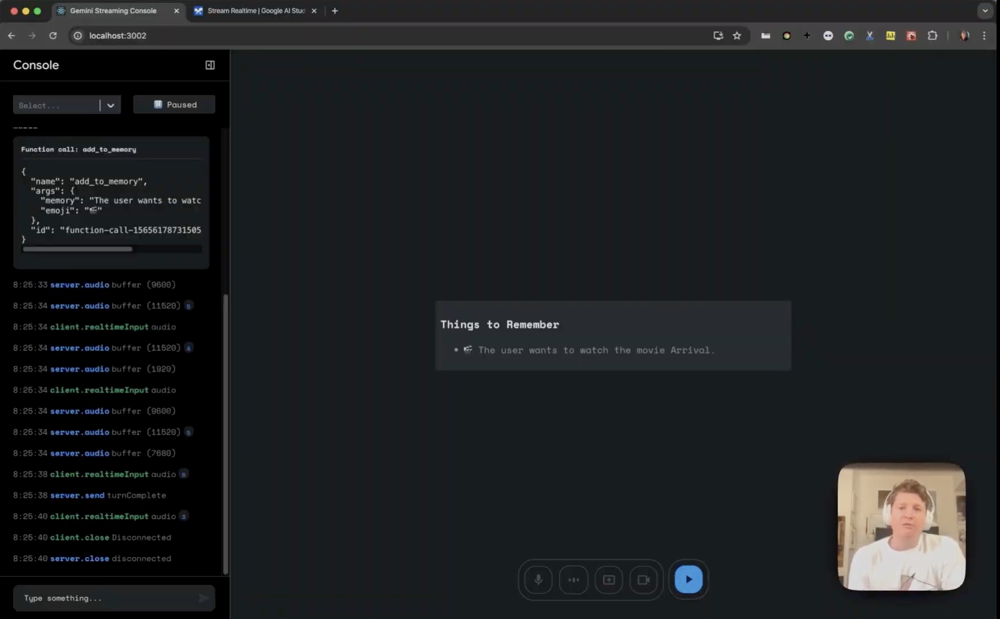

# Gemini Multi Tool

Author: vamramak@google.com

This repository contains a React-based starter app for using the [Multimodal Live API](https://ai.google.dev/api/multimodal-live) over a websocket. It provides modules for streaming audio playback, recording user media such as from a microphone, webcam, or screen capture, as well as a unified log view to aid in the development of your application.

[](https://www.youtube.com/watch?v=J_q7JY1XxFE)

Watch the demo of the Multimodal Live API [here](https://www.youtube.com/watch?v=J_q7JY1XxFE).

## Getting Started

To get started, [create a free Gemini API key](https://aistudio.google.com/apikey) and add it to the `.env` file. Then:

```
$ npm install && npm start
```

We have provided several example applications on other branches of this repository:

- [demos/GenExplainer](https://github.com/google-gemini/multimodal-live-api-web-console/tree/demos/genexplainer)
- [demos/GenWeather](https://github.com/google-gemini/multimodal-live-api-web-console/tree/demos/genweather)
- [demos/GenList](https://github.com/google-gemini/multimodal-live-api-web-console/tree/demos/genlist)

## Widgets

This application includes a variety of widgets to display different types of data. Here's a list of available widgets:

*   **Chat Widget:** Provides a chat interface for interacting with an AI assistant.
*   **CodeExecution Widget:** Allows execution of code snippets (Python, JavaScript, JSON) and displays results with syntax highlighting.
*   **Search Widget:** Allows users to search for information and displays grounded search results.
*   **Weather Widget:** Displays current weather information.
*   **Stock Widget:** Shows real-time stock prices and related data.
*   **Map Widget:** Integrates with Google Maps to display locations and directions.
*   **Places Widget:** Displays information about specific places, including name, address, and ratings.
*   **Nearby Places Widget:** Finds and displays information about places near a given location.
*   **Altair Widget:** Renders graphs using Vega-Embed based on JSON input.
*   **Image Widget:** Displays images.
*   **Document Widget:** Displays documents.

## Example Usage

```typescript
// Example of using the CodeExecutionWidget
<WidgetItem
  item={{
    id: 'code-1',
    type: 'CodeExecutionWidget'
  }}
  widgetData={{
    language: 'python',
    code: 'print("Hello, world!")\ndef add(a, b):\n  return a + b\n\nprint(add(5, 3))',
    output: '', // Output will be populated after execution
    outcome: 'success' // or 'error'
  }}
/>

// Example of using the MapWidget
// <WidgetItem item={{ id: 'map-1', type: 'map' }} widgetData={{ origin: 'London', destination: 'Paris' }} />
```

## Example

Below is an example of an entire application that will use Google Search grounding and then render graphs using [vega-embed](https://github.com/vega/vega-embed).  To use this component, simply import it and include it in your application's JSX, like so: `<Altair />`

```typescript
import { type FunctionDeclaration, SchemaType } from "@google/generative-ai";
import { useEffect, useRef, useState, memo } from "react";
import vegaEmbed from "vega-embed";
import { useLiveAPIContext } from "../../contexts/LiveAPIContext";

export const declaration: FunctionDeclaration = {
  name: "render_altair",
  description: "Displays an altair graph in json format.",
  parameters: {
    type: SchemaType.OBJECT,
    properties: {
      json_graph: {
        type: SchemaType.STRING,
        description:
          "JSON STRING representation of the graph to render. Must be a string, not a json object",
      },
    },
    required: ["json_graph"],
  },
};

export function Altair() {
  const [jsonString, setJSONString] = useState<string>("");
  const { client, setConfig } = useLiveAPIContext();

  useEffect(() => {
    setConfig({
      model: "models/gemini-2.0-flash-exp",
      systemInstruction: {
        parts: [
          {
            text: 'You are my helpful assistant. Any time I ask you for a graph call the "render_altair" function I have provided you. Dont ask for additional information just make your best judgement.',
          },
        ],
      },
      tools: [{ googleSearch: {} }, { functionDeclarations: [declaration] }],
    });
  }, [setConfig]);

  useEffect(() => {
    const onToolCall = (toolCall: ToolCall) => {
      console.log(`got toolcall`, toolCall);
      const fc = toolCall.functionCalls.find(
        (fc) => fc.name === declaration.name
      );
      if (fc) {
        const str = (fc.args as any).json_graph;
        setJSONString(str);
      }
    };
    client.on("toolcall", onToolCall);
    return () => {
      client.off("toolcall", onToolCall);
    };
  }, [client]);

  const embedRef = useRef<HTMLDivElement>(null);

  useEffect(() => {
    if (embedRef.current && jsonString) {
      vegaEmbed(embedRef.current, JSON.parse(jsonString));
    }
  }, [embedRef, jsonString]);
  return <div className="vega-embed" ref={embedRef} />;
}
```

## development

This project was bootstrapped with [Create React App](https://github.com/facebook/create-react-app).
Project consists of:

- an Event-emitting websocket-client to ease communication between the websocket and the front-end
- communication layer for processing audio in and out
- a boilerplate view for starting to build your apps and view logs
- styling using SCSS with reusable mixins for consistent design.

## Available Scripts

In the project directory, you can run:

### `npm start`

Runs the app in the development mode.\
Open [http://localhost:3000](http://localhost:3000) to view it in the browser.

The page will reload if you make edits.\
You will also see any lint errors in the console.

### `npm run build`

Builds the app for production to the `build` folder.\
It correctly bundles React in production mode and optimizes the build for the best performance.

The build is minified and the filenames include the hashes.\
Your app is ready to be deployed!

See the section about [deployment](https://facebook.github.io/create-react-app/docs/deployment) for more information.

_This is an experiment showcasing the Multimodal Live API, not an official Google product. We'll do our best to support and maintain this experiment but your mileage may vary. We encourage open sourcing projects as a way of learning from each other. Please respect our and other creators' rights, including copyright and trademark rights when present, when sharing these works and creating derivative work. If you want more info on Google's policy, you can find that [here](https://developers.google.com/terms/site-policies)._
